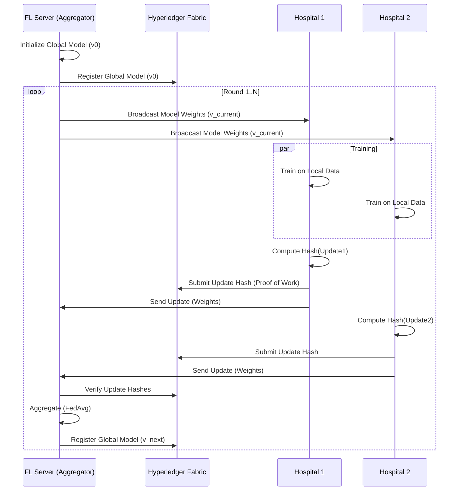

# Federated Learning Architecture

## System Overview

The Federated Learning (FL) system allows multiple hospitals to collaboratively train a global disease prediction model without sharing raw patient data.

## Components

### 1. FL Server (Aggregator)
- **Role**: Coordinates the training rounds.
- **Responsibilities**:
    - Manage the lifecycle of the Global Model.
    - Select participating clients for each round.
    - Receive model updates.
    - Perform Federated Averaging (FedAvg).
    - Interact with Blockchain to record the new Global Model hash.

### 2. FL Client (Hospital Node)
- **Role**: Participant in the training network.
- **Responsibilities**:
    - Download the latest Global Model.
    - Train (fine-tune) the model on local private EHR data.
    - Compute the hash of the trained weights.
    - Submit the hash to the Blockchain (Chaincode).
    - Send the actual weights to the Aggregator securely (e.g., HTTPS/GRPC).

### 3. Blockchain (Fabric)
- **Role**: Trust Anchor and Audit Log.
- **Responsibilities**:
    - `ModelUpdate`: Stores the hash of every update submitted by hospitals. Prevents tampering (e.g., a hospital claiming they trained X when they trained Y).
    - `GlobalModel`: Stores the version history and hashes of the global model.
    - **Incentives**: Can distribute tokens/reputation based on contributions (future phase).

### 4. Data Privacy
- Raw patient data NEVER leaves the hospital's secure environment.
- Only model weights (gradients/parameters) are shared.
- Differential Privacy (DP) can be added to the weights to prevent reverse-engineering (future enhancement).
